#  Relatório de Investigação: BOTS - Getting Started with Splunk

## Informações do Documento

| Campo | Detalhe |
| :--- | :--- |
| **Referência** | BOTS de estudo -- Mitchell Santana Miyake |
| **Data de publicação** | 25/09/2026 |
| **Link** | https://bots.splunk.com/workshop/3JjIyhUc2P7hYfhkBW4OE3 |

## Contexto

O módulo "Getting Started with Splunk for Security" é um workshop prático projetado especificamente para introduzir os participantes à plataforma Splunk no contexto de segurança. Utilizando o dataset do BOTS 1.0 (Boss of the SOC), o objetivo central deste desafio é fornecer uma compreensão sólida de como o Splunk pode ser operado para responder de forma mais eficaz a incidentes de segurança cibernética.

---
## Sumário

* [Contexto](#contexto)

* [Desenvolvimento e Análise](#desenvolvimento-e-análise)

  * [Checkpoint 1 - Q1](#checkpoint-1---q1---based-on-the-streamhttp-sourcetype-what-is-the-likely-ip-address-scanning-imreallynotbatmancom-for-web-application-vulnerabilities)

  * [Checkpoint 1 - Q2](#checkpoint-1---q2---based-on-the-suricata-sourcetype-what-is-most-likely-the-ip-address-that-is-being-scanned)

  * [Checkpoint 1 - Q3](#checkpoint-1---q3---based-on-the-iis-data-what-user-agent-string-is-most-frequently-seen-during-web-scan)

  * [Challenge Question 1](#challenge-question-1---what-are-the-top-10-urls-being-returned-during-the-scan-on-imreallynotbatmancom)

  * [Challenge Question 2](#challenge-question-2---what-ip-address-is-likely-attempting-a-brute-force-password-attack-against-imreallynotbatmancom)

  * [Checkpoint 2 - Q1](#checkpoint-2---q1---based-on-the-streamhttp-sourcetype-how-many-events-had-a-http_user_agent-that-contained-both-os-x-and-chrome)

  * [Checkpoint 2 - Q2](#checkpoint-2---q2---based-on-the-streamhttp-sourcetype-what-is-most-frequently-seen-url-that-does-not-reference-joomla)

  * [Challenge Question 3](#challenge-question-3---on-august-10-2016-what-was-the-first-brute-force-password-used)

  * [Challenge Question 4](#challenge-question-4---which-six-character-password-in-the-brute-force-attack-is-also-a-coldplay-song)

  * [Challenge Question 5](#challenge-question-5---stats-is-for-more-than-counting)

  * [Challenge Question 6](#challenge-question-6---calculating-an-average-and-rounding-the-result)

  * [Challenge Question 7](#challenge-question-7---visualizing-frequency)

  * [Challenge Question 8](#challenge-question-8---using-transactions)

  * [Challenge Question 9](#challenge-question-9---ip-and-geolocation-mapping)

  * [Checkpoint 3 - Q1](#checkpoint-3---q1---on-august-24-2016-how-many-characters-were-in-the-longest-command-executed)

  * [Checkpoint 3 - Q2](#checkpoint-3---q2---show-the-top-5-windows-event-codes-for-the-server-we8105deskwaynecorpinclocal-as-a-pie-chart)

  * [Checkpoint 3 - Q3](#checkpoint-3---q3---generate-a-list-of-sites-visited-on-august-242016)

* [Conclusão e Lições Aprendidas](#conclusão-e-lições-aprendidas)
---
## Desenvolvimento e Análise

### Checkpoint 1 - Q1 - Based on the stream:http sourcetype, what is the likely IP address scanning imreallynotbatman.com for web application vulnerabilities: 

A questão sugere a busca baseada no sourcetype stream:http para acessos ao domínio imreallynotbatman.com, para isso utilizei o seguinte comando:

```
index=botsv1 imreallynotbatman.com sourcetype="stream:http"
```

Ao analisar o resultado, percebi que existia apenas um host. A requisição deste host possui uma clara tentativa de injeção de SQL por tempo, visível no campo src_content da seguinte imagem. 

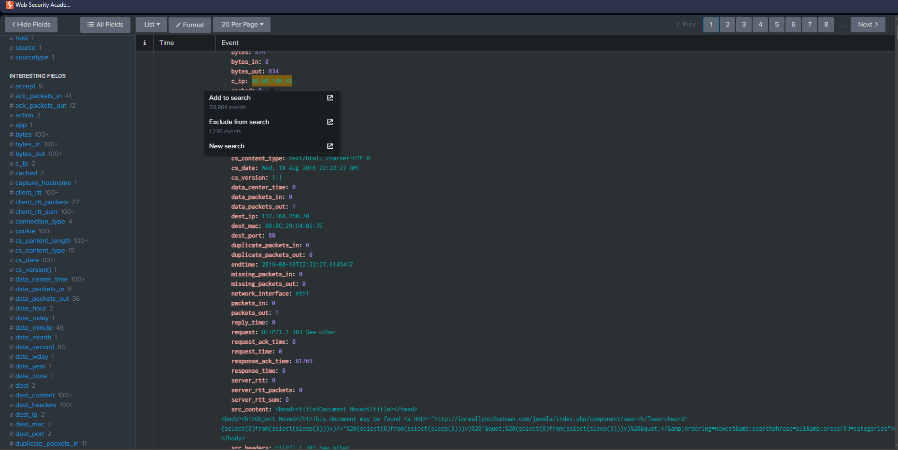

Logo o endereço ip verificando vulnerabilidades é 40.80.148.42, como descrito no campo c_ip.

### Checkpoint 1 - Q2 - Based on the suricata sourcetype what is most likely the IP address that is being scanned:

Para descobrir o que o atacante está escaneando, filtramos a query pelo tipo suricata e pelo endereço ip encontrado na última etapa com o seguinte comando:

```
index=botsv1 sourcetype=suricata 40.80.148.42 | stats count by dest_ip
```

Ao filtrar a query resultante por ip de destino obtemos o seguinte resultado:

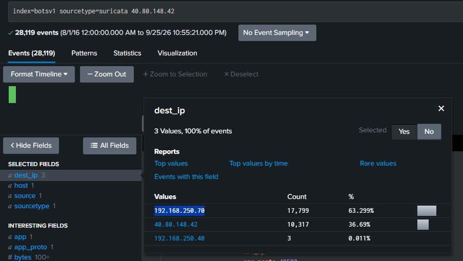

Logo o endereço com 17,799 contagens de aparência como ip_dest provavelmente é o ip alvo, sendo ele **192.168.250.70**

### Checkpoint 1 - Q3 - Based on the IIS data, what user agent string is most frequently seen during web scan:

Para descobrir a string user agent mais frequente nos dados IIS, executei a seguinte query:

```
index=botsv1 IIS | stats count by http_user_agent
```

O resultado da query, descrito na imagem, nos permite afirmar que a string que buscamos é **Mozilla/5.0 (Windows NT 6.1; WOW64) AppleWebKit/537.21 (KHTML, like Gecko) Chrome/41.0.2228.0 Safari/537.21**

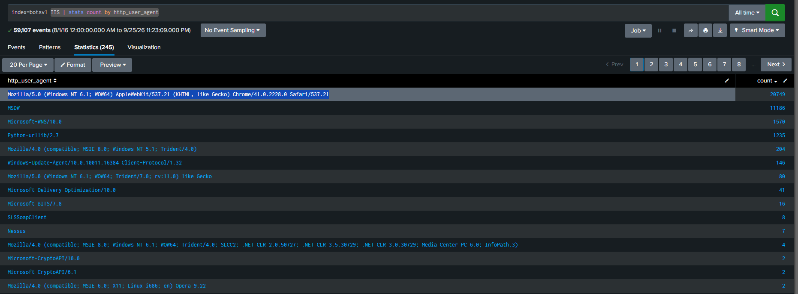

### Challenge Question #1 - What are the top 10 URLs being returned during the scan on imreallynotbatman.com:

Para obter as 10 urls mais retornadas filtramos a origem do dado pelo ip do atacante e agrupamos por url, com o seguinte comando:

```
index=botsv1 imreallynotbatman.com src=40.80.148.42 | stats count by url | sort -count | head 10
```

Desse modo obtemos o top 10, como exibido na imagem:

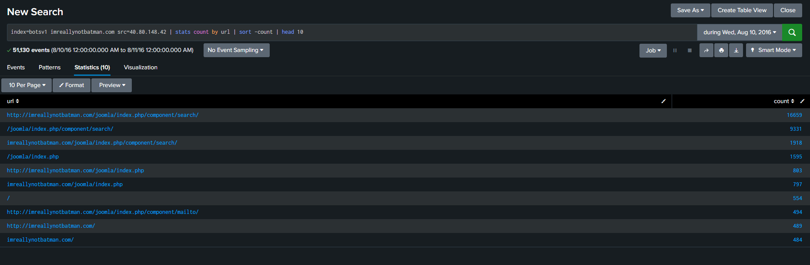

### Challenge Question #2 - What IP address is likely attempting a brute force password attack against imreallynotbatman.com:

O desafio sugere a execução do seguinte comando: `index=botsv1 sourcetype=stream:http dest=192.168.250.70 http_method=POST`.
Ele também cita uma tentativa de força bruta, por isso decidi incluir `pass*` na consulta em busca de variantes da palavra password. A execução desse comando resultou nos seguintes achados:

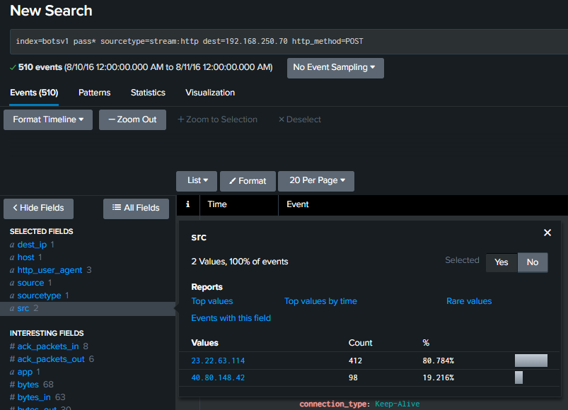

Podemos notar um endereço ip que não havíamos visto previamente, o ip **23.22.63.114**, ao verificar diretamente suas requisições obtemos a seguinte imagem:

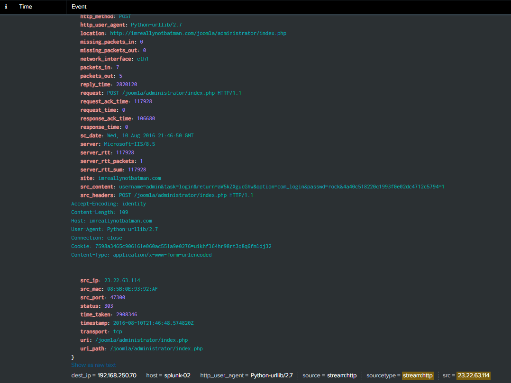

Filtrando por este novo endereço, obtemos múltiplas tentativas de login, provavelmente resultado da execução de uma wordlist, esta hipótese é praticamente comprovada pelo fato do http_user_agent ser uma distribuição python.
Logo o endereço ip tentando realizar um ataque de força bruta é de fato **23.22.63.114**.

### Checkpoint 2 - Q1 - Based on the stream:http sourcetype, how many events had a http_user_agent that contained both OS X and Chrome? Provide a tabular list with the time, source address and the user agent strings:

Primeiramente devemos filtrar os dados pedidos, utilizando asteriscos para encontrar os campos http_user_agent que possuem ambos OS X e Chrome, isso foi feito com o seguinte comando:

```
index=botsv1 sourcetype=stream:http http_user_agent="*OS X*" http_user_agent=*Chrome*
```

Em seguida devemos montar a tabela, basta adicionar `table http_user_agent src _time` ao comando anterior para obter o seguinte resultado:

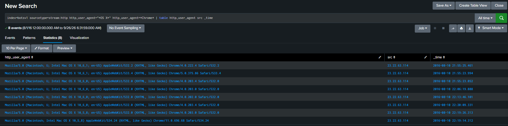

### Checkpoint 2 - Q2 - Based on the stream:http sourcetype, what is most frequently seen URL that does not reference joomla? How many times do we see this URL?

Para obter a contagem de URLs que não referenciam joomla basta utilizar `index=botsv1 sourcetype=stream:http NOT url=*joomla*` para encontrar as entradas sem joomla e adicionar `stats count by url` para contar as entradas:

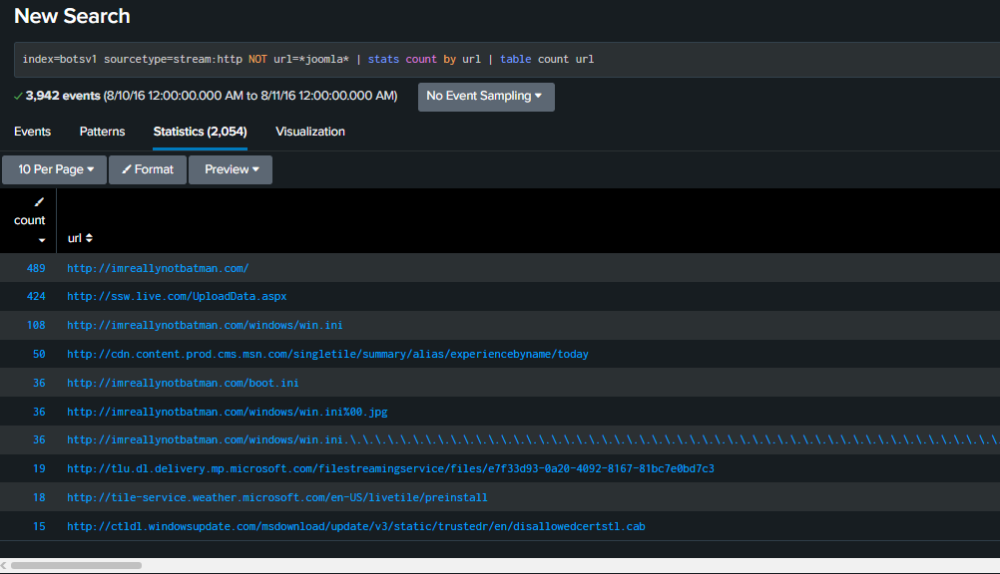

Logo obtemos que a URL com maior frequência possui **489** entradas.

### Challenge Question #3 - On August 10, 2016, what was the first brute force password used?

O desafio sugere o uso da query `index=botsv1 sourcetype=stream:http dest=192.168.250.70 http_method=POST form_data=*username*passwd*` para obter todas tentativas de força bruta.
A solução que encontrei foi filtrar estes dados em uma tabela por _time e form_data, como os dados retornados são ordenados do mais recente para o mais antigo, basta inverter a tabela para encontrar a primeira senha utilizada.

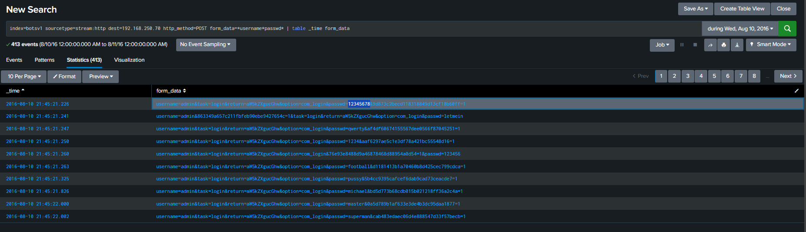

Logo a primeira senha utilizada foi **12345678**

### Challenge Question #4 - Which six-character password in the brute force attack is also a Coldplay song?

Para obter a lista de senhas utilizadas, executamos o `rex` sobre o comando do desafio anterior, que extrai por meio de regex a senha na string form_data, para obter a seguinte tabela:

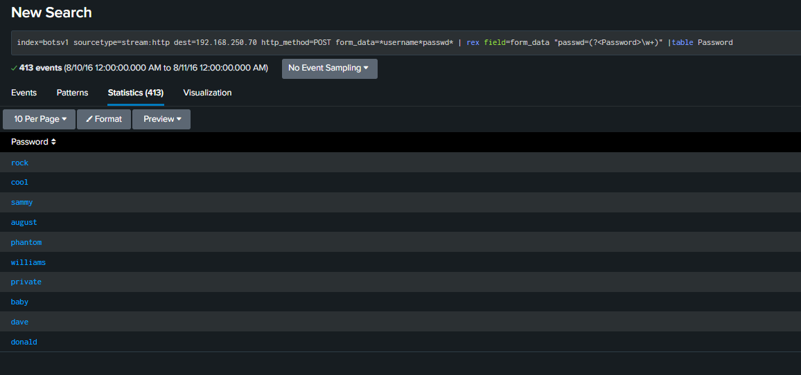

Em seguida limitamos o regex de busca para seis caracteres com o comando `rex field=form_data "passwd=(?<Password>\w{6})\b"`
Por fim, utilizei o `lookup` sobre o csv da discografia do ColdPlay passando o parâmetro Password para comparação com a coluna song, além de utilizar o search para não incluir os valores nulos.

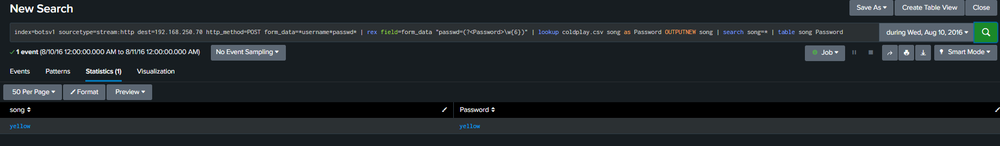

### Challenge Question #5 - Stats is for More Than Counting

O objetivo deste desafio é encontrar se alguma senha do brute force foi utilizada mais de uma vez, além disso os dados devem ser disponibilizados em uma tabela com src, count e userpassword.
A fim de obter a contagem dos valores utilizamos a funcionalidade `count` do `stats` para contar os ips de origem e exibi-los por senha tentada, com trecho a seguir:

```
stats count values(src) as src by userpassword
```

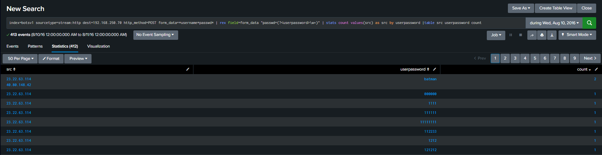

### Challenge Question #6 - Calculating an Average and Rounding the Result

Para calcular a média de tamanho das senhas e arredondá-la, utilizei `eval` e `stats`, este nos permite calcular a média enquanto aquele é utilizado para obter o tamanho e arredondar, como descrito no seguinte trecho:

```
eval Length=len(userpassword) | stats avg(Length) as avg_len| eval rounded=round(avg_len,0)
```

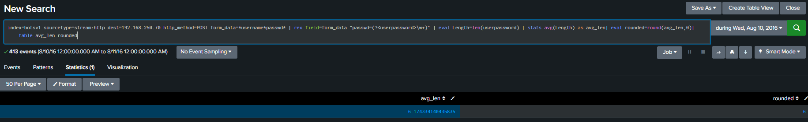

### Challenge Question #7 - Visualizing Frequency

O intuito do desafio é plotar a frequência de tentativas de uso de senha no ataque de força bruta com o uso do `timechart`.
Definindo o span de um segundo e contando pelos ips de origem obtemos o seguinte gráfico.

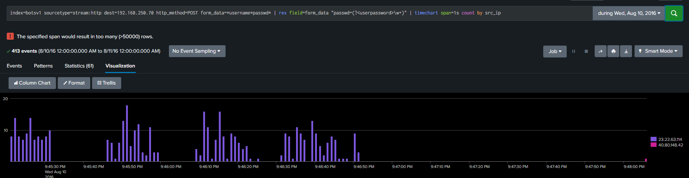

### Challenge Question #8 - Using Transactions

Este desafio propõe o cálculo do tempo entre os dois usos da senha "batman".
Para isso vamos utilizar o transaction, que obtém a diferença entre valores numéricos quando passamos um valor que é igual em outra entrada da tabela, nesse caso a senha.

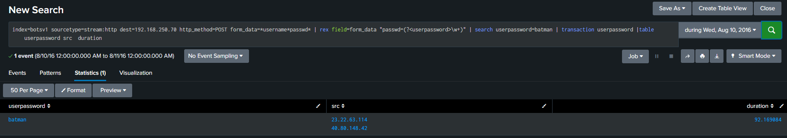

### Challenge Question #9 - IP and Geolocation Mapping

A intenção desta questão é ensinar o uso dos comandos `iplocation` e `geostats` para lidar com metadados de localização e plotá-los em gráficos.
O `iplocation` recebe um ip e retorna dados de localização como cidade, região, país, latitude e longitude, como podemos observar na seguinte imagem.

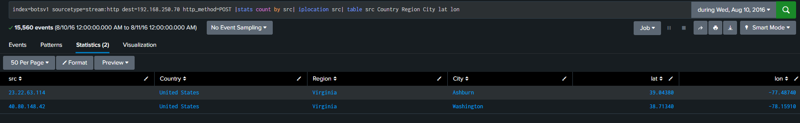

O `geostats` por sua vez recebe latitude e longitude para plotar a localização no mapa, como no exemplo a seguir:

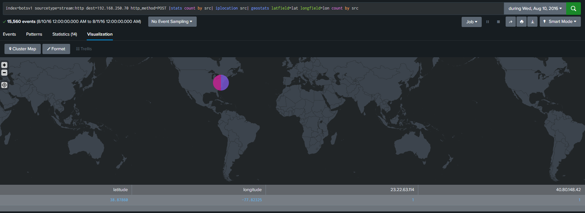

### Checkpoint 3 - Q1 - On August 24, 2016, how many characters were in the longest command executed? what was the name of the executable that was part of the command
Utilizando a dica da questão, realizei a busca por registros de Microsoft Sysmon e tentei obter registros relacionados a linha de comando, como é visível na seguinte imagem:

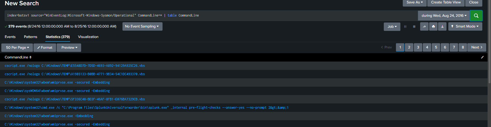

Ao encontrar os comandos, basta filtrá-los para obter o maior utilizando o len() e extrair o executável do evento.

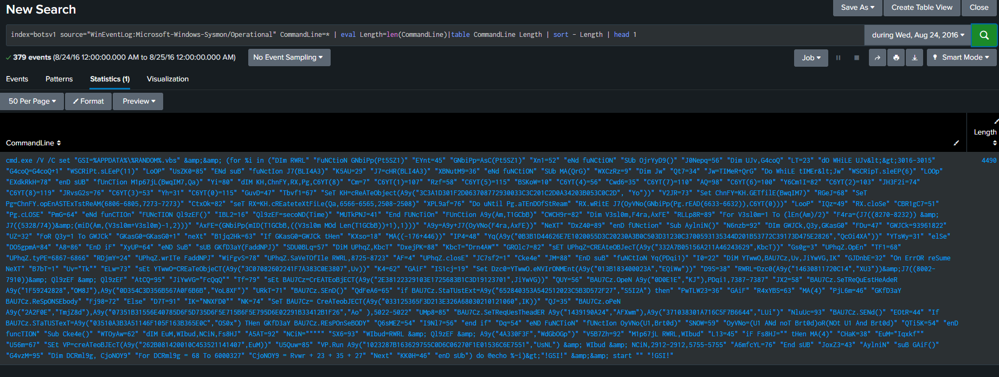

Desse modo encontramos a entrada com tamanho **4490** e o seu respectivo executável **cmd.exe**

### Checkpoint 3 - Q2 - Show the top 5 Windows Event Codes for the server we8105desk.waynecorpinc.local as a pie chart. The date range should be all day, August 24,2016

Primeiramente devemos limitar os dados para fonte "we8105desk.waynecorpinc.local" e limitar o tipo da fonte para os logs relacionados à segurança.
Em seguida, filtramos e selecionamos os dados contando as entradas por EventCode, os ordenando e cortando para uma fatia legível, para então obter o seguinte resultado:

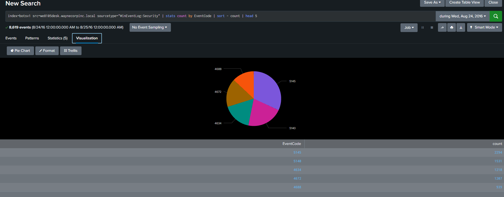

### Checkpoint 3 - Q3 - Generate a list of sites visited on August 24,2016 and provide the sum of the bytes_in and bytes_out, the destination IP, associated URLs and the source IPs that visited the site
Inicialmente deve ser realizada a limpeza dos sites, utilizei o seguinte comando para exibi-los e filtrar os desnecessários:

```
index=botsv1 sourcetype="stream:http" | stats count by site|table count site
```

Com ele fui adicionando filtros à query até chegar no seguinte comando:

```
index=botsv1 sourcetype="stream:http" site!=192.168.* site!=*microsoft* site!=*google* site!=*live.com site!=*.msn.com site!=*windows* site!=*ocsp.* site!=www.bing.com*
```

Assim que os dados foram filtrados, utilizei o `stats` para agregar os dados, aplicando `sum()` nos dados byte_in e byte_out e `values()` para agrupar as entradas de url e src.
Dessa maneira obtive o seguinte resultado:

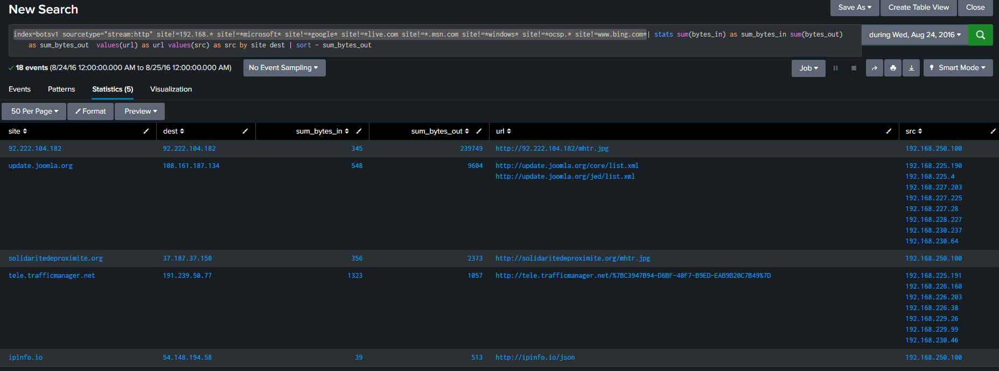
---

## Conclusão e Lições Aprendidas

Nesta primeira etapa de exploração baseada no laboratório do BOTS, o foco principal foi a familiarização e o domínio prático das ferramentas e comandos nativos do Splunk. Através da navegação por diferentes tipos de logs de segurança, foi possível compreender como o Splunk organiza e disponibiliza dados estruturados.

**O que aprendi neste laboratório:**
*   **Manipulação de Dados com SPL:** Aplicação prática de comandos estatísticos e de filtragem essenciais, como `stats`, `top`, `sort` e `table`, para organizar grandes volumes de eventos.
*   **Extração e Transformação:** Uso avançado de funções como `rex` para criar campos extraídos via expressões regulares e `eval` para cálculos dinâmicos durante a busca.
*   **Visualização e Correlação temporal:** Exploração de metadados com comandos de geolocalização (`iplocation`, `geostats`), mapeamento temporal (`timechart`) e o agrupamento de eventos relacionados usando `transaction`.